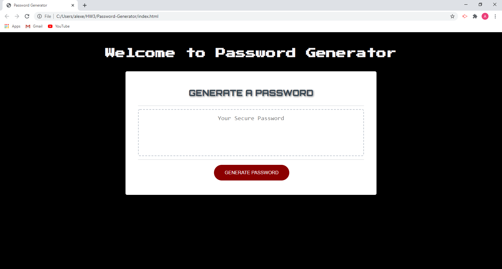

# Password-Generator
 
<a href="https://alexemrob.github.io/Password-Generator/">Click to Visit My Page!</a>
  

  

Follow the prompts to dertermine: <ul><li>how many characters you would like the password to be (options ranging 8-100)</li>
  <li>would you like to include numbers</li>
  <li>would you like to include special characters</li>
  <li>would you like to include uppercase letters</li>
  <li>would you like to include lowercase letters</li></ul>

 
Once all parameters are defined, the random password will appear

    
